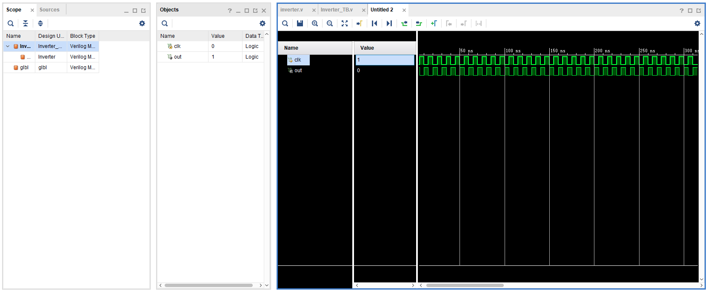

# Verilog仿真流程

- 首先明确，`Verilog`是硬件描述语言，描述的是数字电路信号的逻辑连接关系。
- 其次明确，`Verilog`只是描述电路，没有说具体的实现。实现电路时可以用基础门连接、可以用查找表等。

## 编写Verilog

以下面的反相器模块为例：

```verilog
module Inverter(in, out);
input in;
output out;

assign out = ~in;

endmodule
```

在`Vivado`中，该文件被称作`design source`，后缀为`.h`。


## 查看电路图

在`Vivado`的`RTL Analysis`中，点击`Schematic`中可以看到该模块的一种电路实现：


可以看到这里就是用一个非门实现了实际的电路。

## 编写测试文件

`Verilog`分为可综合的部分和不可综合的部分。我们在编写`testbench(测试文件)`的时候会使用一些不可综合的语法。

```verilog
`timescale 1ns / 1ps
`define PERIOD 10

module Inverter_TB();
    reg clk;
    wire out;

    initial begin
        forever
            #(`PERIOD/2) clk = ~clk;
    end

    initial begin
        clk = 1'b0;
    end

    Inverter myInverter(
        .in(clk),
        .out(out)
    );
endmodule
```

测试文件在`Vivado`中被称作`simulation source`。


## 仿真

在`Vivado`中展开`Simulation`菜单，点击`Run Simulation`，可以得到模块的输入输出随时钟信号的变化。



可以看到反相器的功能验证正确。
