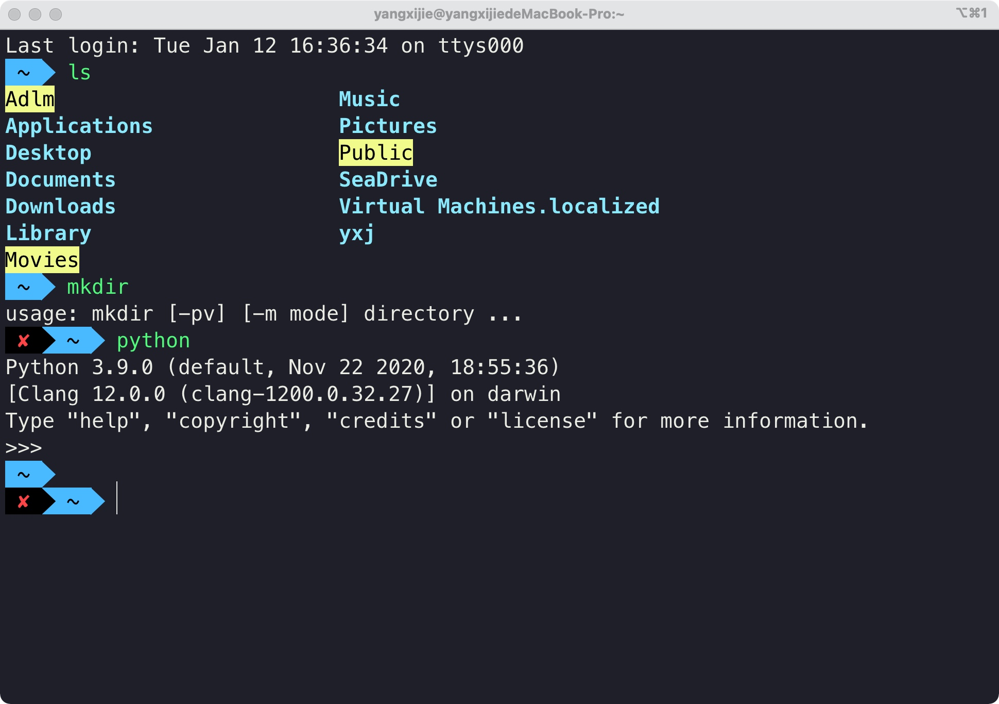
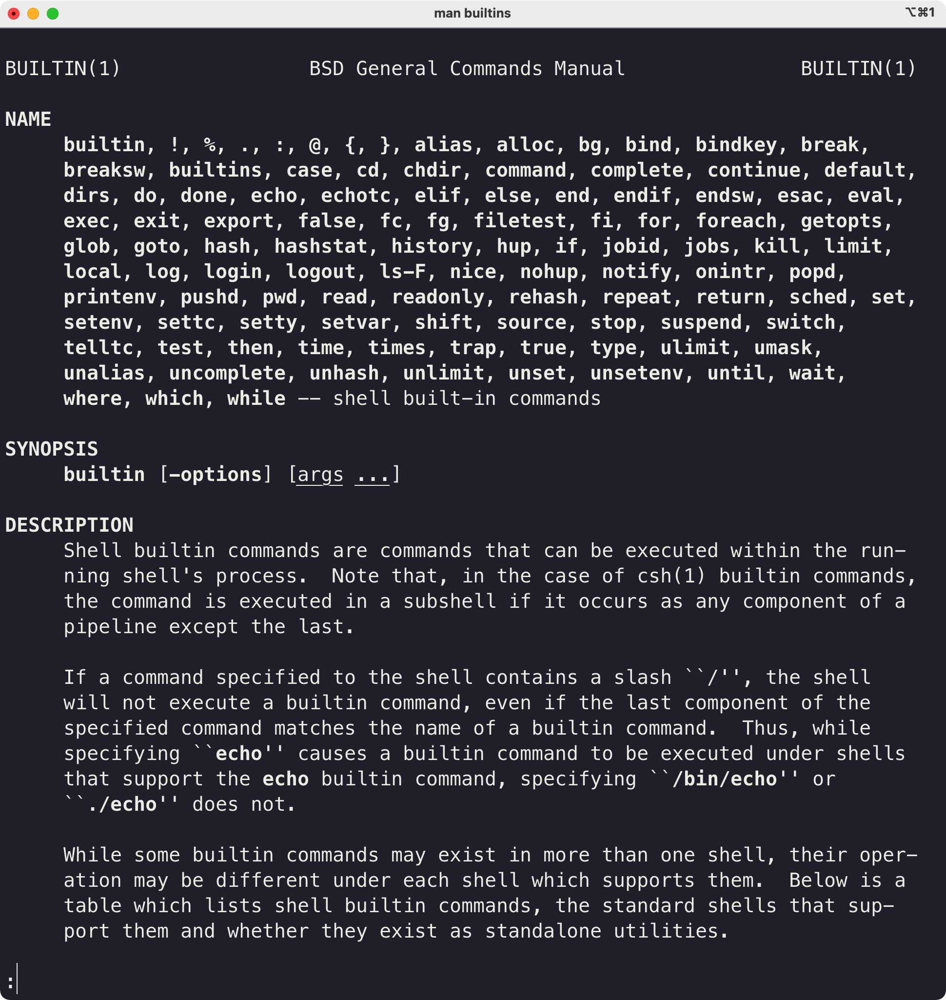

# 4 认识终端和shell

上节课我们已经打开了终端。这节课我们要深入认识终端。

先简单回顾一下：

终端提供的是一个输入命令（字符串）和输出提示（字符串）的环境，而`shell`则负责解析从终端输入的命令。

## 内建程序与内建命令

我们打开终端，这时其实相当于打开了`shell`。上节课我们通过`shell`运行了一些程序（`say_hello` `/bin/date` `/bin/mkdir`）。其实`shell`自身也带着一些程序（二进制可执行文件），这些程序就叫内建程序。

`shell`内建程序的独特之处是，我们在调用这些程序的时候只需要敲一个单词就行了。**一个单词**，**很短**，所以我们就把它们称作内建命令。

顺带一提，系统自带的那些程序如果也能用一个单词就调用那么也可以称它们为系统命令。

内建命令有很多，我们只介绍一些比较重要的：`which` `echo` `history` `pwd` `cd`

## 与路径无关

### which

查看`shell`如何解释后面的命令

```bash
which which
which echo
which history
which pwd
which cd
```

得到结果：`which: shell built-in command`

### echo

将后面输入的东西返回。看起来很没用，但是在显示变量的时候会显示变量的值而不是那个字符串

```bash
echo hello
echo $SHELL
```

查看正在使用的`shell` `echo $SHELL`。其实还有好多其他的`shell`，但是我们用`macOS`默认的`shell`——`zsh`就好了。（小知识：在macOS 10.15 `Catalina`之前`macOS`默认的`shell`是`bash`，其实二者的区别并不大，作用都是解析你输入的命令）

### history

```bash
history
history -5
```

### date

接下来我们尝试一下`which date`。

发现`shell`返回了`/bin/date`！回顾`which`的作用，`which`会查看后面输入的东西作为命令如何被`shell`解析。也就是说，如果你在`shell`输入`date`，相当于输入`/bin/date`。那么我们要看时间怎么看啊，直接输入`date`，`shell`就会帮我解析这个单词，然后去调用在文件系统中的`/bin/date`这一个二进制程序，执行这个程序，然后返回当前的时间。

然后我们灵光一现，那是不是很多系统命令都可以用一个单词调用呢？

是这样的，我举一个例子。`which mkdir`，发现也是返回我们之前用的`/bin/mkdir`。那么我们以后用mkdir的时候是不是就不用写路径了，直接写单词就OK。

### 说明

既然不论是内建命令还是系统命令，都可以用一个单词替代，那么我们之后就不要太区分它们啦，反正都是命令，都是用一个单词告诉`shell`要调用哪个程序，本质上是一样的。

注：为什么会这样呢？调用程序写完整路径可以调用，但是一个单词给`shell`、`shell`就能知道这个程序在哪里？好奇怪啊。原因我会在这节课的最后讲环境变量的时候提及。现在先认为这就是`shell`的功能好了。

## 与shell当前工作目录相关

刚刚我们讲内建命令的时候还说了两个命令，`pwd`和`cd`。但是刚刚插着讲了`shell`的一些常用命令于是就跳过了。接下来我们来讲这些命令。

接下来讲的命令的一些不同是命令的输入和执行或多或少会依赖`shell`的当前工作目录，与文件的路径相关。

### pwd

接下来开始介绍文件路径——绝对路径和相对路径

我们之前所说的路径都是绝对路径，也就是从根目录开始。但其实还有相对路径。

```bash
pwd
```

开始介绍shell的当前工作路径

`.` `..` `...` `-` `~`

小问题：`~/Desktop`是相对路径还是绝对路径？（A：绝对路径。因为`~`和`/User/yangxijie`是等价的）

（好的习惯是目录后面再加一个斜杠，而文件后面不加（我因为这个吃过亏，但还是懒得改））

### cd

跳转`shell`的当前工作目录到指定的目录

这时我们就可以来验证上面学到的相对路径了

不过我们先试试绝对路径。再来相对路径

（查看命令前面的符号）

之前的程序`/Users/yangxijie/Desktop/teaching_materials/say_hello`，直接输入`say_hello`shell会告诉你它不认识这个单词，不认识这个命令

但是要调用这样的程序未免也太长了吧，我们能不能简化一些？

先`cd`到`/Users/yangxijie/Desktop`这时里面会有一个可执行文件

直观的想法是`say_hello`

但是进入目录后直接输入字符串`zsh`会把这个当作一条命令然后它发现并没有找到这个命令（当然了`say_hello`不是`shell`的内建命令环境变量里面也没有它所以当然出现下面的提示了`zsh: command not found: say_hello`

怎么让`shell`知道输入的`say_hello`不是命令而是我们想要执行的程序呢？我们输入`./say_hello`就好了。相当于写了一个绝对路径对吧（`.`相当于pwd带入）

## 总结

以上我们主要学习了两种内建命令：一种与文件系统/路径无关，一种与文件系统/路径有关。但是之后我们也不会去区分这两种命令了。

也就是说，之后命令就是命令，不管那是内建的还是系统的、也不管它和文件系统、路径是否沾边。

之前这么讲是希望大家能有一个较为清晰的思路认识这些命令、认识`shell`解析命令与执行程序的关系。但是之后在敲命令的不用太过考虑这些东西，命令就是命令，就只是一个单词、只是一句话而已。

## shell常用命令

接下来我们还会再介绍一些shell常用的命令和操作。

（参考[2020年清华大学电子系科协暑培｜Linux](https://eesast.github.io/training2020/linux-webserver/linux.html)）

#### ls

列出当前文件夹下的所有文件

```bash
ls
ls -a
ls -l
```

#### cat

```bash
cat hello.txt
```

#### clear

清空终端中存在的已经执行过的命令

（`history`仍然可以查看）

#### mkdir

在当前目录下创建文件夹

#### touch

在当前目录下创建文件（一般这么创建的文件是文本文件）

#### rm

移除某个文件（注意不是移动到废纸篓，而是直接抹掉，就 没了）

移除某个文件夹`rm -d testDirectory`

强制删除`rm -rf testDirectory`（使用一定慎重！！！）

#### mv/cp

移动文件与复制文件

移动文件到原地相当于重命名

#### open

```bash
open foo.md
open -a Visual\ Studio\ Code.app foo.md
open $(pwd)
open .
```

`-a`参数制定打开的程序（需要使用程序全名）

`$(pwd)`表示当前目录，`open $(pwd)`表示用`Finder`打开`shell`当前的工作目录 (`open .`也可)

补充：在安装好`VS Code`之后，可以在`~/.zshrc`中添加：

```zsh
export PATH="$PATH:/Applications/Visual Studio Code.app/Contents/Resources/app/bin"
```

之后用在shell中敲命令`code <folder>`用`VS Code`打开文件夹（工作区）。

#### man

以`date`为例

（有的没有）

`--help`（但是有的也没有）

## shell常用的操作

#### 输出流重定向

还记得`echo`吗？

```bash
touch my.txt
echo "hello world" > my.txt
echo "hhhh" > my.txt
echo "hahahaha" >> my.txt
```

#### 管道

`|`: 上一个命令（程序）的输出作为下一个命令的输入

比如我想看看我刚刚创建了什么文件夹来着：我可以一条一条翻，但是我也可以搜索啊！

```bash
history
history | grep "mkdir"
```

#### ⌃C

#### 空格

举例：创建一个含有空格的文件夹，结果发现创建了两个

加入`\`或`""`

## 终端进阶与常用的终端操作

如果大家想对终端、`shell`、命令行深入了解，可以查看下面的课程：

这是对我帮助很大的一门课程

[计算机教育中缺失的一课 The Missing Semester of Your CS Education 中文版](https://missing-semester-cn.github.io)

#### where

`where`也是一个`shell`内建命令。`where`和`which`的功能差不多，也是告诉我们一个命令如何被`shell`解析。区别是，`shell`能够告诉我们`shell`去解析这个命令的全部可能性。

```bash
where which
```

我们可以看到，其实在`shell`输入命令`which`的时候，`shell`觉得：啊，这个单词有两种方法可以被我解析：第一种是我自己带的内建程序；第二种是系统自带的程序；不过我自己用我自己自带的程序效率更快，毕竟是我自己的东西，所以就用自己的喽。其实，我感觉`which`就是`where`的第一行，对吧。

#### vim极简入门（只要能写东西进去就好了）

（编辑一个文本为例）

推出插入模式并保存退出：⎋ 冒号 `wq` 回车

#### ⌃D
（`bash`举例）

#### chmod

修改文件权限。

如果你希望一个文件有可执行权限：

```bash
chmod a+x <file>
```

（没有深入）

## 回顾

如果要总结这节课所学的终端、`shell`与之前课程的联系，那就是把之前很长的命令给简化了。原本调用程序的过程我都扔给`shell`去做，我敲命令告诉`shell`干什么就ok了。

比如：

### 简化前面的命令 之 创建文件夹

`/bin/mkdir /Users/yangxijie/Desktop/newFolder`这样我们可以先`cd`过去

前面省略程序路径是因为`shell`知道你那个单词代表路径为`/bin/mkdir`的程序，所以我们省略交给`shell`一个单词就好。

后面为什么可以省略呢？那是因为`shell`有一个叫当前工作目录的东西，因此很多绝对路径可以用相对路径来代替。我们可以先`cd`到需要建目录的地方然后敲`mkdir newFolder`

### 简化前面的命令 之 执行自己写的程序

之前说shell内建的程序和系统的大多数二进制程序都可以通过命令让`shell`帮我们执行。但是自己写的程序`shell`是`不认识`的

但是你仍然可以切换到相应的目录，然后用`./<your_execFile>`

## 补充：环境变量

### 引言

我们之前采用了几种方法来简化终端敲命令的长度：

最开始说的是：`shell`认识你给它的命令（单词），所以它就帮你用这个命令（单词）找到你需要执行的程序，然后执行这个程序

后来还讲过一种：因为`shell`自身有一个`当前工作目录`，所以关于路径的东西都可以写相对路径。通过`cd`命令`cd`到某个目录之后，接下来需要路径的命令都可以省略掉绝对路径而使用相对路径。

第二种的原理已经很清楚。但是，第一种，也就是最先说的那一种，`shell`是怎么认识我们给它的单词呢？？？

接下来我们简单说一下这个事情。

### 环境变量

查看环境变量

```bash
echo $PATH
```

其中冒号是分隔符。当你给`shell`扔了一个命令之后，`shell`先在自己的内建程序中找有没有这个单词，没找到再到环境变量去找。
（回顾`where`）

### 为什么要用环境变量呢？

因为一个相同的程序，在不同的计算机上可能安装在不同的位置。

比如我写了一个`python`脚本，在脚本的第一行指出了我电脑里面的`python`路径。然后你看了这个脚本，觉得挺好用的，我就复制了一份给你。结果你的电脑上`python`并没有装在那里，那不就凉了吗？你执行这个我写的脚本的时候系统就找不到`python`的解释器于是无法运行这段脚本。

### 补充：添加环境变量

添加环境变量等（大家可以自己去了解一下，自己写的程序可以这么搞，但一般都不这么搞。不过你要是下个`python`解释器，这个时候你就要给`python`的解释器添加环境变量了，因为很多别的软件都会用到`python`，这些软件希望它们用一个单词`python`就能找到`python`的解释器。（在`macOS`上这件事情交给`brew`去做，不用你手动添加；但是`Windows`上可能你就要手动添加环境变量了））

## 其他的工具

### shell脚本 - 组合你的命令

`shell`脚本（以我写的处理视频的脚本为例：脚本是一段代码，组合了很多命令[mkv2mp4_fcp](https://github.com/Yang-Xijie/mkv2mp4_fcp)）

### homebrew - macOS快速安装命令行程序

`homebrew`（在哪里下载图形化界面的程序？`App Store`。那么在哪里下载命令行程序呢？当然是…`Homebrew`。就是一个名字。我们可以通过Homebrew来安装各种命令行工具并进行使用（补充：`brew`也可以用来安装一些图形化工具）[brew官网](https://brew.sh)）如果有机会我会出后续的教程

### zsh配置文件

`~/.zshrc`

### 配置终端 - 打造舒适终端

终端配置(（拿我自己的电脑说一下事儿）（给出链接大家自己想配可以配置一下）如何配置很漂亮的终端）

{width="300"}

可以参考：

[iTerm2 + Oh My Zsh 打造舒适终端体验](https://segmentfault.com/a/1190000014992947)

[Mac OS 终端利器 iTerm2](https://www.cnblogs.com/xishuai/p/mac-iterm2.html)

如果有机会我会出后续的教程

### 用户与群组

用户`yxj`和`sudo` `root`（`whoami` `who`等（系统偏好设置的切换用户（不过看我视频教程的人应该都是用自己的`mac`，所以不会牵扯到这个问题。如果你是`Linux`服务器管理员，那么可能要设置多个用户了。））

### 查看所有的shell内建命令

`man builtins`可以查看shell的所有内建命令

{width="300"}

`man zshbuiltins`可以查看到zsh的所有内建命令。（也可以先`man zsh`，然后在下方找到这个`zshbuiltins`）

## 结束

大家估计听完这四节课都着急了，怎么还没见到`VS Code`的影子呢？

别急，现在你已经有了足够的基础可以听懂我接下来在讲什么，那我们就开始打开`VS Code`的大门吧！！！