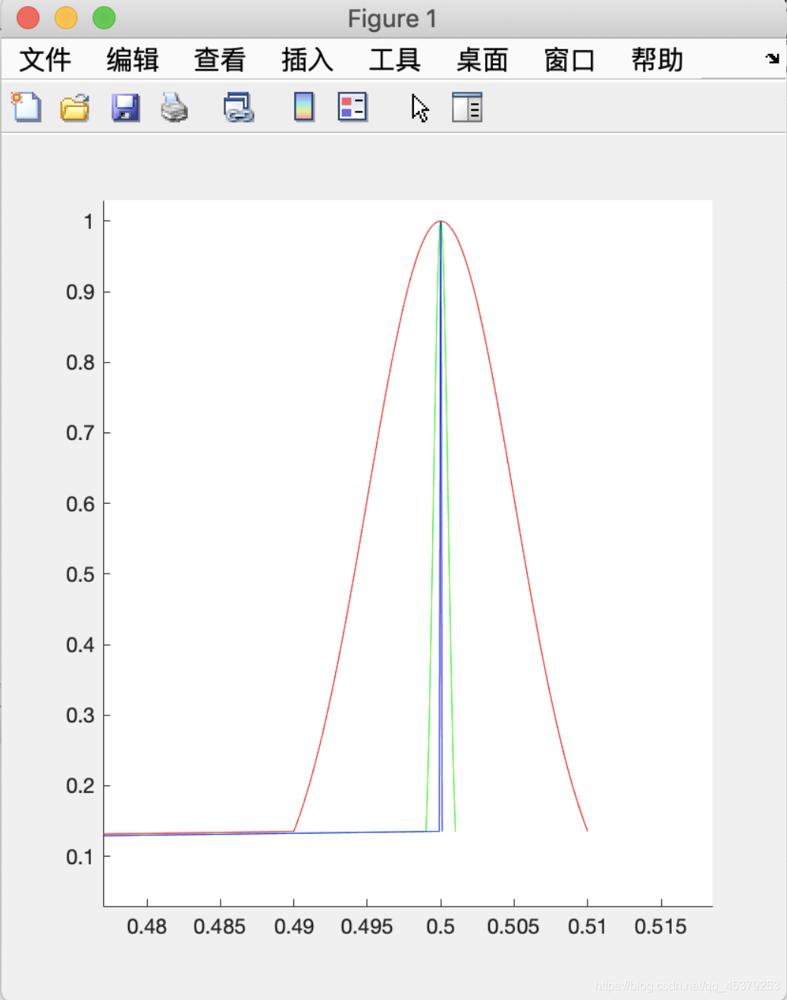

# MATLAB探究抛硬币的涨落问题

# 问题

一道大物探究题：抛硬币的涨落问题

如果你准备抛N次, 把获得正面朝上占比为n/N的概率计为P(n/N).计相对概率

Q(n/N)= P(n/N)/ P(n/N=1/2)

以n/N为横轴,Q为纵轴为作Q(n/N)~ n/N曲线图, 分别取$N=10^4, 10^6, 10^8$，电脑画图.所有的图取同一尺度,比较对照后, 你能得出什么结论? 

# 思路与实现

可以得到：\\( Q(\frac{n}{N})=\frac{comb(N,\ n)}{comb(N,\ N/2)} \\)

但是这个数太大了，要是直接用组合数公式算计算机也吃不消

考虑Stirling公式 \\( n ! \approx \sqrt{2 \pi n}\left(\frac{n}{e}\right)^{n} \\)

考虑取了对数搞回去，写出如下的 MATLAB 函数`proQ.m`

```matlab
function y= proQ(n,N)
e=exp(1);
a = log(N) + N*log(N/2/e) - log(2) - 0.5 * log(n*(N-n)) - (N-n)*log((N-n)/e)-n*log(n/e);
y=exp(a);
end
```

再写一个作图的函数`draw.m`，其中i的范围不需要从1到N因为重点关注中间一段的涨落情况

```matlab
function [x,y] = draw(N)
for i=(N/2-sqrt(N)):(N/2+sqrt(N))
    x(i)=i/N;
    y(i)=proQ(i,N);
end
end
```

最后是脚本：

```matlab
clear x y

figure(1)
hold on

[x,y]=draw(10^4);
plot(x,y,'r')

clear x y
[x,y]=draw(10^6);
plot(x,y,'g')

clear x y
[x,y]=draw(10^8);
plot(x,y,'b')

disp('END')
```



结束！