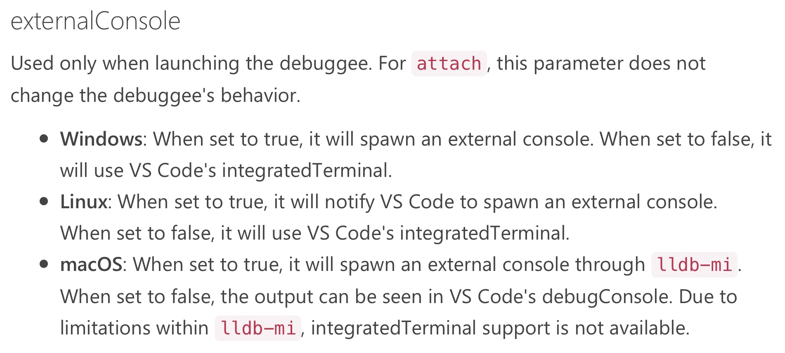
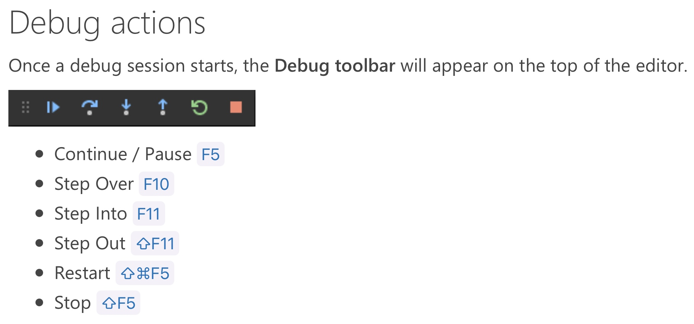

# 7 用VSCode调试Cpp代码

- [7 用VSCode调试Cpp代码](#7-用vscode调试cpp代码)
- [前言](#前言)
- [Important Docs](#important-docs)
  - [VS Code｜User Guide](#vs-codeuser-guide)
    - [User Guide｜Tasks](#user-guidetasks)
    - [User Guide｜Debugging](#user-guidedebugging)
    - [实用技巧：输入输出重定向](#实用技巧输入输出重定向)
  - [VS Code｜C++](#vs-codec)
    - [C++｜Clang on macOS](#cclang-on-macos)
    - [C++｜Debug](#cdebug)
    - [C++｜launch.json](#claunchjson)
- [tasks.json](#tasksjson)
  - [从上到下讲……](#从上到下讲)
  - [Other two choices](#other-two-choices)
  - [总结](#总结)
- [launch.json](#launchjson)
  - [从上到下讲……](#从上到下讲-1)
  - [hello_world.cpp](#hello_worldcpp)
  - [调整终端和vscode的位置](#调整终端和vscode的位置)
  - [使用VSCode的集成终端？](#使用vscode的集成终端)
  - [斐波拉契数列周期](#斐波拉契数列周期)
  - [其他调试技巧](#其他调试技巧)
- [7 调试](#7-调试)
- [补充](#补充)
- [总结](#总结-1)

# 前言
调试是什么，就是debug（查看`Run -> Start Debugging`）。debug是什么：你在写代码的时候会有一些地方写的有问题，这些问题就被称作bug。bug原意为虫子。de前缀有去除的意思，debug就是指“去掉虫子”，也就是找代码中的错并改正。仔细看VSCode边栏的运行图标，发现就有一只虫子。

至于为什么debug被翻译为调试呢？大概就是说，你调一调（调整）代码，试着改一改代码，就把错误找出来了。

这一课会大量参考VS Code的官方文档，这是因为一份配置文件怎么写，不会有什么教程比官方文档写得更清楚了。是的，包括我现在正在录制的这一课的教程。我推荐你直接看官方的文档；不过，我还是有那么一丢丢自信比官网文档总结的好那么一点点。所以，你可以先听我讲的，如果觉得我哪里讲得不好，你可以移步官方文档查看对应的部分。

首先先简单看一看这些文档吧。
# Important Docs
[VS Code｜docs](https://code.visualstudio.com/docs)
## VS Code｜User Guide
### User Guide｜Tasks
Tasks in VS Code can be configured to run scripts and start processes so that many of these existing tools can be used from within VS Code without having to enter a command line or write new code.

Workspace or folder specific tasks are configured from the `tasks.json` file in the `.vscode` folder for a workspace.

[VS Code｜User Guide｜Integrate with External Tools via Tasks](https://code.visualstudio.com/docs/editor/tasks)

在VSCode中可以自定义一些task（任务），这些任务会帮你自动化执行一些东西。任务的配置文件是`tasks.json`
### User Guide｜Debugging
One of the key features of Visual Studio Code is its great debugging support. VS Code's built-in debugger helps accelerate your edit, compile and debug loop.

VS Code keeps debugging configuration information in a `launch.json` file located in a `.vscode` folder in your workspace (project root folder).

[VS Code｜User Guide｜Debugging](https://code.visualstudio.com/docs/editor/debugging)

如果你需要debug，那么VSCode提供了这样的平台。debug的配置文件是`launch.json`
### 实用技巧：输入输出重定向
[VS Code｜User Guide｜Debugging | Redirect input/output to/from the debug target](https://code.visualstudio.com/docs/editor/debugging#_redirect-inputoutput-tofrom-the-debug-target)
## VS Code｜C++
### C++｜Clang on macOS
[VS Code | C++ | Using Clang in Visual Studio Code](https://code.visualstudio.com/docs/cpp/config-clang-mac)

（但是我觉得这一篇实在误人子弟……至少我觉得两处不太妥当；还是看上面的那个`User Guide｜Tasks`和`User Guide｜Debugging`吧）
### C++｜Debug
[VS Code | C++ | Debug C++ in Visual Studio Code](https://code.visualstudio.com/docs/cpp/cpp-debug)

（和`User Guide｜Debugging`相比没有什么新东西）
### C++｜launch.json
The `launch.json` file is used to configure the debugger in Visual Studio Code.

[VS Code Official Docs | Configuring C/C++ debugging](https://code.visualstudio.com/docs/cpp/launch-json-reference)

（很重要的文档，几乎说明了C++调试配置文件launch.json所有选项的含义）

# tasks.json
```json
```
## 从上到下讲……
最后的一点先留着，讲到debug的时候再说。
## Other two choices

## 总结
你会发现你自己也能在tasks.json里面自己写一个Code Runner了是吧？确实是这样（不过Code Runner的功能还是多一些，也支持别的语言，更方便一些）

在下拉框选中之后就可以直接F5开始调试了
# launch.json
## 从上到下讲……
## hello_world.cpp
你会发现出现问题，终端没有打印信息

[GitHub issue｜VS Code因权限无法打开系统终端](https://github.com/microsoft/vscode-cpptools/issues/5079)


回到`tasks.json`⇧⌘P执行解决问题
## 调整终端和vscode的位置
关闭全部 ⇧⌘W
## 使用VSCode的集成终端？
如何在调试的时候不使用系统的终端而使用VSCode的集成终端？

你肯定觉得这么做很麻烦，Code Runner都可以让提示信息出现在集成终端，那我调试代码也把程序的输出放到集成终端可以吗？很遗憾，这件事情在macOS上做不到。

当时GitHub issues上也有人问过这件事情。

[GitHub｜issue: Open the externalConsole inside the VSCode Terminal in OSX](https://github.com/microsoft/vscode-cpptools/issues/3338)

（查看我的回答；图片会挂是因为GitHub的服务器在国外……）非常遗憾，也许之后能支持，但是现在not available。（真的很可惜）

[VS Code官方文档｜Configuring C/C++ debugging之externalConsole](https://code.visualstudio.com/docs/cpp/launch-json-reference#_externalconsole)



## 斐波拉契数列周期

## 其他调试技巧

大家自己体验一下，我就不做过多的解释了。


# 7 调试


在VSCode设置里面的首选项的`file.exclude`里面添加`**/*.dSYM`和`**/*.out`


# 补充
我的想法是希望你在一个文件夹`Cpp`中写所有的Cpp代码，这在学习Cpp和编写简单Cpp代码时是非常合适的（我这么做发现很方便）。但是请注意：如果你用VS Code来做一个`C++`项目，那最好还是另开一个新的文件夹；毕竟在VSCode中，一个文件夹就是一个项目。
# 总结
这节课我们主要学习了如何写两份配置文件：`tasks.json`可以用配置任务实现自动化；`launch.json`用来配置VSCode调试的方法。现在，如果你只是要执行你的代码，⌘R直接用插件Code Runner解决问题，非常快。如果你需要调试，那就打上断点，然后F5（或者触控栏上的播放按钮）；由于可能需要多次打开调试，这时你需要将终端和VSCode分屏获得好一些的体验。

上节课说这是最后一节课，但我之后应该还会录制两节课。一节是课程回顾，会讲讲这门课的设计思路，同时也会安利一些我自己用的插件，顺便也推荐一些可以深入学习的地方。另一节准备做一个极速版的教程，因为对于一些心急的人来说，可能总共加起来快5个小时的视频教程还是有一些长；另外对于认真听完课程的同学，可能也需要一个快速回顾如何配置编程环境的总结性视频。

如果你跟着这六节课（除去最开始的一节）走下来，我相信你会少走很多弯路。以后写代码也会觉得很舒适。还记得我在第一节课说的课程目标吗？我希望这份教程能让一年半前刚刚拿着mac入门Cpp编程的我少一年的迷茫，我想我应该做到了这一点。

这一节课就到这里了！